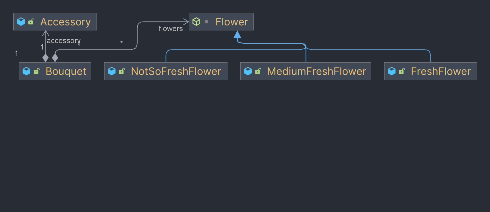

# Software Development Java Lab6

My variant: 1222

- С13 = 0 = Flowers

## Prerequisites

- JDK 21
- Gradle 8.4

## Getting Started

Follow the steps below to get the project up and running on your local machine:

### Cloning the repository:

On both Windows and Linux systems, you can clone the repository using the following command:
```bash
git clone https://github.com/Trototoo/SD-java-lab1
```

## Running the project:

1. Open Command Prompt (or PowerShell) and navigate to the project directory.
2. To run the project, run:
```bash
gradle run -q --console=plain
```

## Class Diagram

